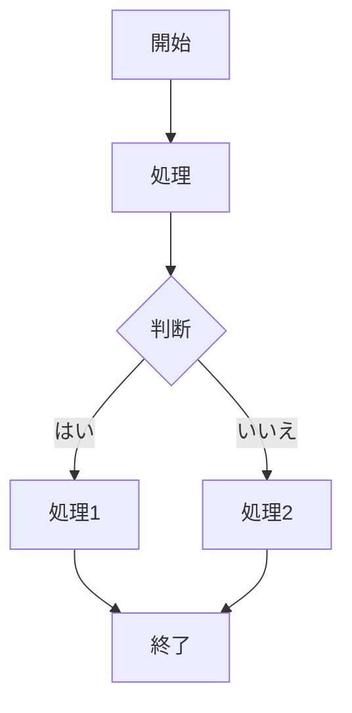
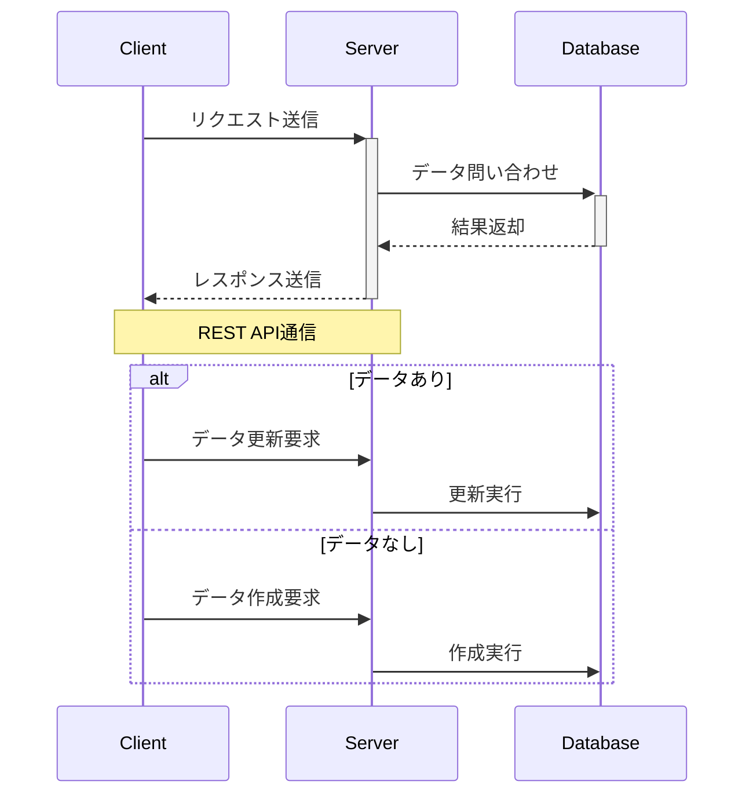
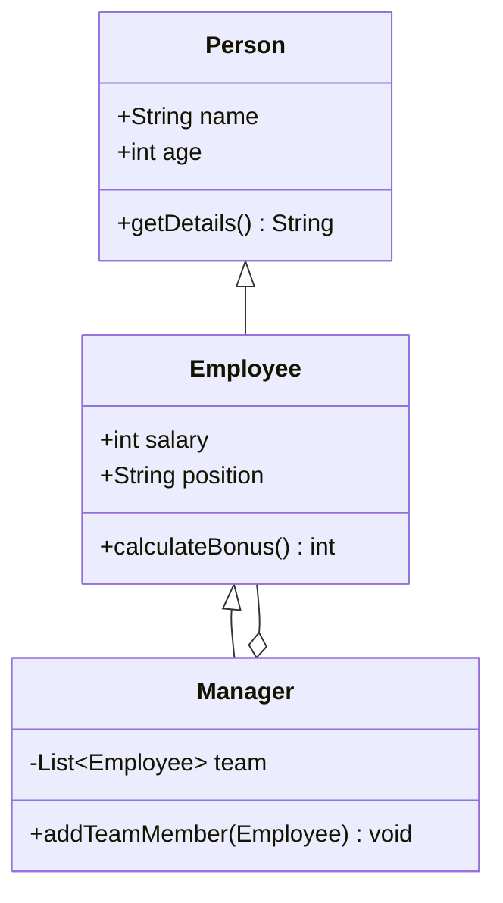
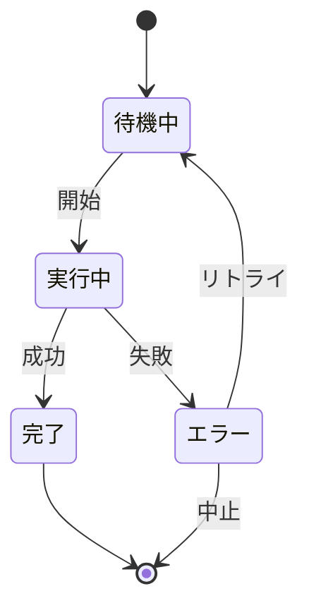
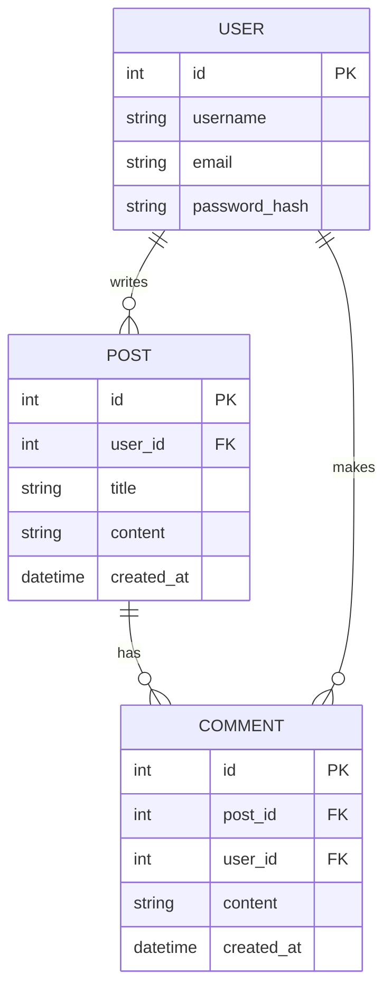
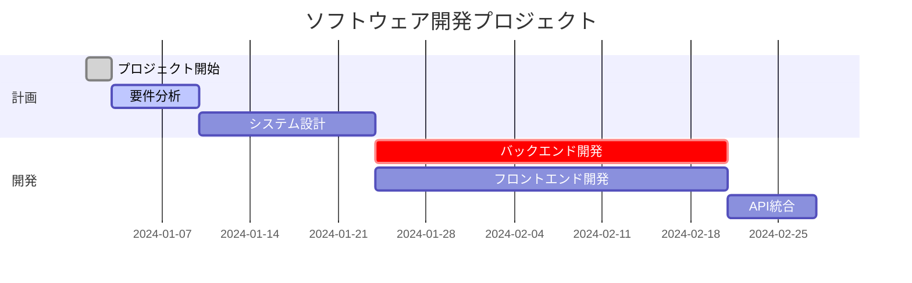
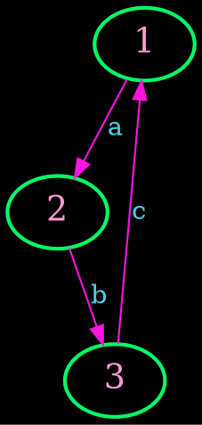
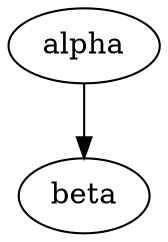

# Markdown Demo

## markmap

```markmap
## マークマップ表示デモ
マインドマップのようにマークダウンの内容を図で表現します。

### 見出しレベル3

- **見出し**:
  情報を整理するための階層構造を作成します。
- **リスト**:
  情報を箇条書きに整理します。
- **強調**:
  **太字**または*斜体*。
- `1行コードフェンス`
- コードフェンス
    ```python
    print("hello")
    ```

### リストの例

マークダウンでは、ハイフン (`-`) やアスタリスク (`*`) を使って簡単にリストを作成できます。

- 最初の項目
- 2番目の項目
  - 入れ子の項目 A
  - 入れ子の項目 B
- 3番目の項目

### 番号付きリストの例

数字とピリオド (`1.`, `2.`) を使用します。

1. ステップ 1: 準備
1. ステップ 2: 実行
1. ステップ 3: [リンク](https://)
1. ステップ 4: 結果を表示

```

## mermaid













## graphviz




