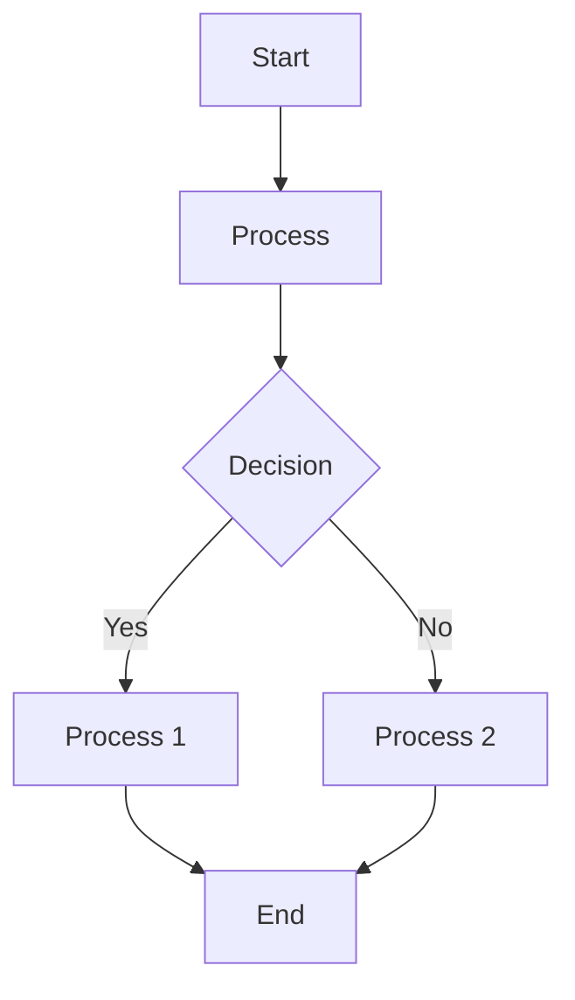
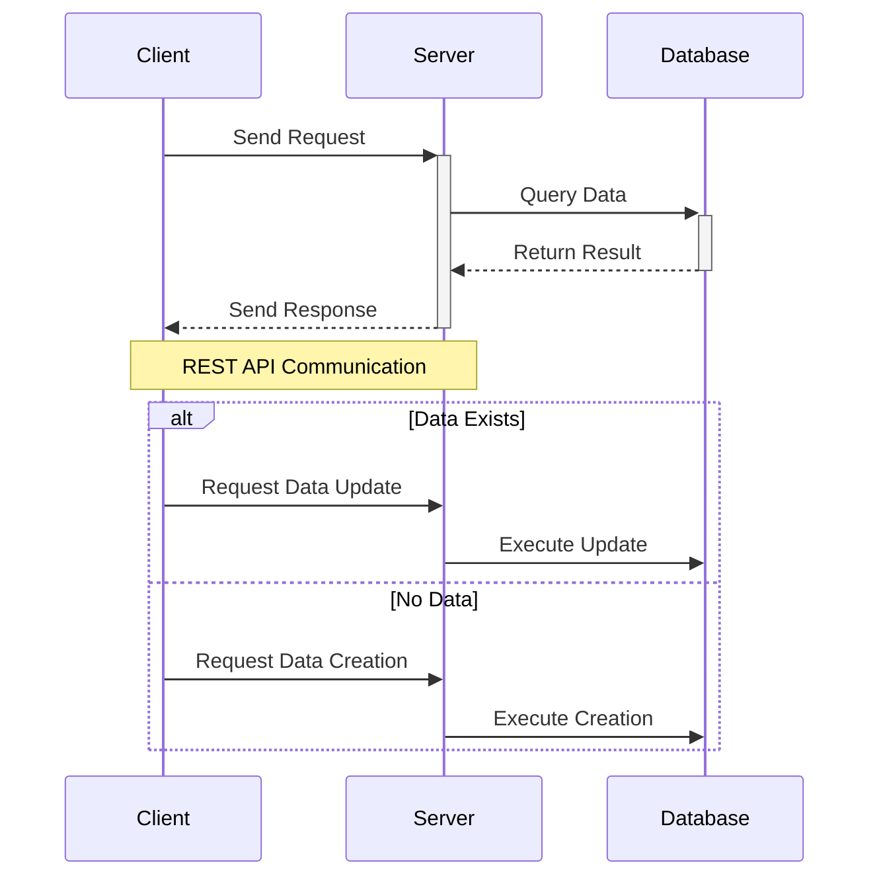
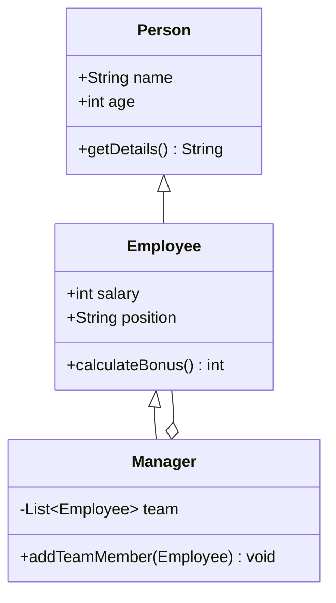
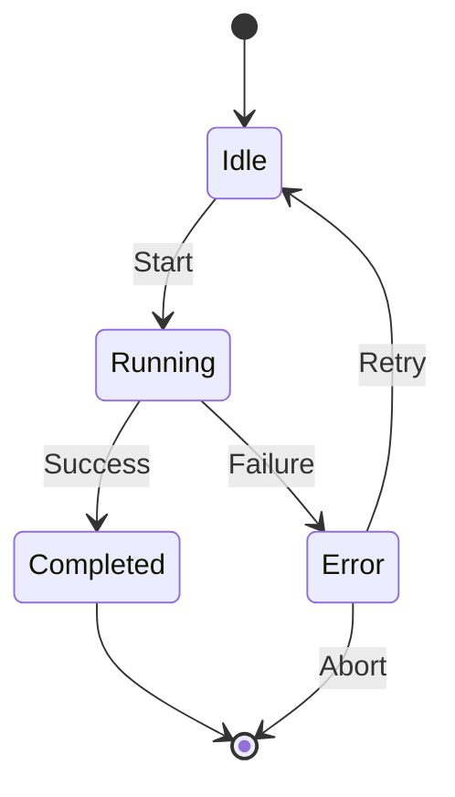
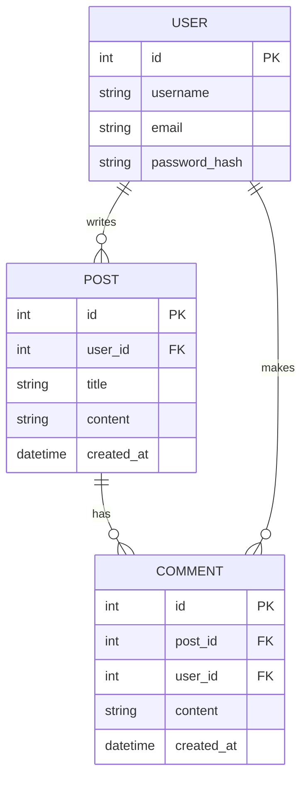
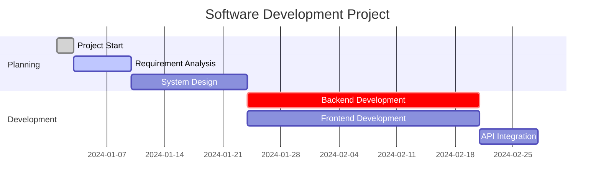
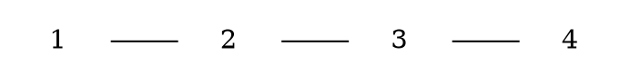
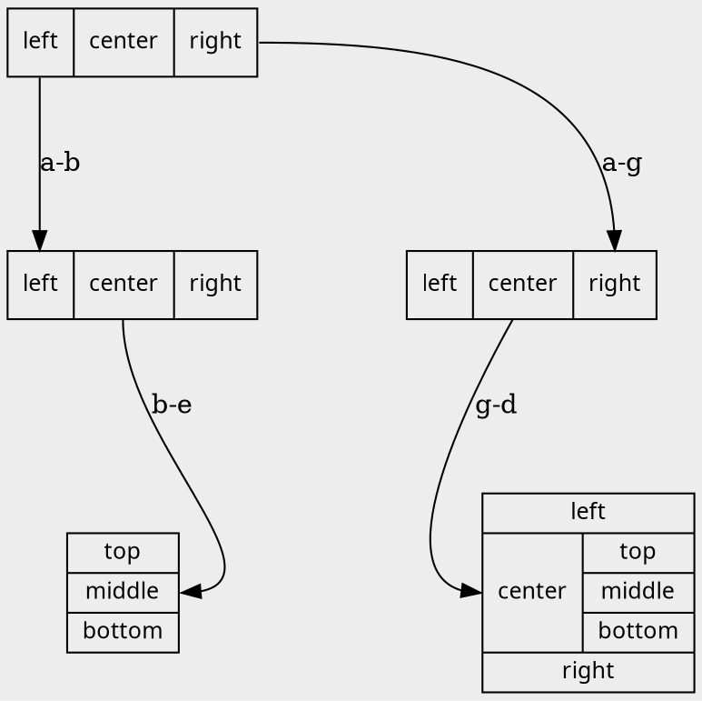

# **Markdown Preview Plus** Demo

## markmap

```markmap
## Markmap Display Demo
Visualizes Markdown content as a diagram like a mind map.

### Heading Level 3

- **Heading**:
  Creates a hierarchical structure to organize information.
- List:
  Organizes information in bullet points.
- **Emphasis**:
  **Bold** or *Italic*.
- `Inline code fence`
- Code fence
    ```python
    print("hello")
    ```

### List Example

* First item
* Second item
  * Nested item A
  * Nested item B
* Third item

### Numbered List Example

1. Step 1: Preparation
1. Step 2: Execution
1. Step 3: [Link](https://)
1. Step 4: Show link destination

```

## mermaid

- Flowchart



- Sequence



- Class Diagram



- State Diagram



- ER Diagram



- Gantt Chart



## graphviz

- Flowchart



- Record


